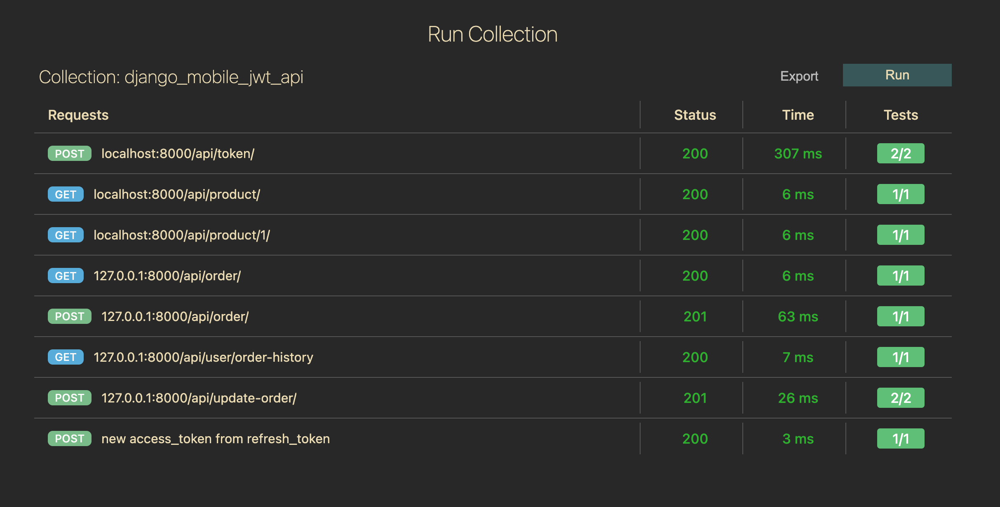

# orderly


- [x] Customers may exchange their username and password for an authentication token
- [x] Customers may see a paginated list of products. Each product in the list should have the following details: id, name, price, and quantity in stock
- [x] Customers may order the products they need
- [x] Number of products in stock should decrease after an order is made
- [x] Customers may see their history of orders.


## Installation

create a python virtual environment at the root of the project. I am using python 3.8.9
and install all the python dependencies from requirements file

```
python3 -m venv venv
source venv/bin/activate
cd mobileBackend
pip install -r requirements.txt
```

## How to run ?

```
python manage.py makemigrations
python manage.py migrate
python manage.py runserver
```

[Database Design](./docs/database-design.md)
## How to deploy ?

### on a linux server instance/node

1. use the production ready gunicorn server instead of built-in development server
2. Run gunicorn with 4 or more workers as a long running process or a service

### on a containerized serverless environment

- Dockerize the python application using a Dockerfile
- tag and push the new image to the container registry
- set-up a web-hook or a CI/CD process for deploying the new image from registry to contaner environment or kubernetes


### :v: Get in touch with me

> I am looking for Jobs ... :sunglasses:

- [Github](https://github.com/avimehenwal/)
- [My Website](https://avimehenwal.in)
- [My Blog v2](https://avimehenwal2.netlify.app/)
- [Twitter Handle](https://twitter.com/avimehenwal)
- [LinkedIn](https://in.linkedin.com/in/avimehenwal)
- [Stackoverflow](https://stackoverflow.com/users/1915935/avi-mehenwal)

<a href="https://www.buymeacoffee.com/F1j07cV" target="_blank"></a>

Spread Love :hearts: and not :no_entry_sign: hatred [](https://twitter.com/avimehenwal)